# Телеграм бот HR-анкета

## Как запустить:

### 1. Клонировать репозиторий

```bash
git clone https://github.com/KELONMYOSA/tg-hr-form-bot.git
```

### 2. Создать .env файл

#### .env example

```
BOT_TOKEN=TgB0tT0k3N
EMAIL_SMTP_HOST=mail.domain.com
EMAIL_SMTP_PORT=587
EMAIL_SENDER=info@domain.com
EMAIL_RECIPIENT=target@domain.com
```

### 3. Запустить docker-compose

```bash
docker compose up -d
```

## User Flow

```mermaid
graph TB
    start("start")
    consentQuestion["Привет! Спасибо за проявленный интерес к работе в Комфортел! <br> Чтобы мы могли договориться о дальнейшем сотрудничестве, нам важно получить от тебя некоторую информацию. <br> Ты даёшь согласие на обработку своих данных?"]
    yesConsent("Да")
    noConsent("Нет")
    getInfo("Отлично! Давай знакомиться. <br> Я чат-бот компании Комфортел. <br> Напиши, пожалуйста, как тебя зовут? (формат: Фамилия Имя)")
    chooseDirection("На каком направлении ты учишься?")
    chooseCourse("А курс?")
    chooseSphere("Мы всегда рады предложить интересные карьерные возможности. <br> Пожалуйста, выбери сферу, в которой бы тебе хотелось развиваться (указать цифру): <br> 1. Разработка <br> 2. Техническая поддержка <br> 3. Инфраструктура, сети <br> 4. Управление проектами (телеком, IT) <br> 5. B2B Продажи <br> 6. Финансы, бухгалтерия <br> 7. HR, психология <br> 8. PR, маркетинг, event, графический дизайн <br> 9. Другое")
    internshipQuestion("Ты заинтересован в стажировке/практике?")
    noInternship("Нет")
    yesInternship("Да")
    yesInternshipText("Да это мэтч! <br> Не стесняйся, пиши рекрутеру компании Анне Кучер в tg - @kucher_hr, <br> указав примерные даты практики/стажировки и три вещи, которым хочешь научиться у нас.")
    fullTimeWorkQuestion("Ты заинтересован в работе на полный день?")
    yesFullTime("Смело отправляй свое резюме и сопроводительное письмо на почту hh@comfortel.pro, <br> указав почему ты хочешь работать именно у нас")
    noFullTime("Нет")
    finalStep("А теперь финальный этап! <br> Напиши свой контактный телефон в формате +7 ХХХ ХХХ-ХХ-ХХ")
    finalText("Мы очень рады, что ты хочешь расти и развиваться вместе с нами! <br> Мы свяжемся с тобой в ближайшее время. А пока предлагаем заглянуть на наш сайт https://comfortel.pro <br> и ознакомиться с актуальными вакансиями https://hh.ru/employer/965294?hhtmFrom=vacancy <br> До встречи!")
    backToInternship("Назад")
    specifyDesires("Если выбран ответ 9. <br> 'Опиши свои пожелания к будущему месту работы (условия, график, команда, задачи и др.)'")
    noConsentReaction("Нам очень жаль! <br> Твои контакты нужны исключительно для HR-менеджера. <br> В ближайшее время он свяжется с тобой, чтобы обсудить возможные варианты сотрудничества. <br> Начнем заново?")
    restart("Да")

    start --> consentQuestion
    consentQuestion --> yesConsent
    consentQuestion --> noConsent
    yesConsent --> getInfo
    getInfo --> chooseDirection
    chooseDirection --> chooseCourse
    chooseCourse --> chooseSphere
    specifyDesires --> internshipQuestion
    chooseSphere --> specifyDesires
    chooseSphere --> internshipQuestion
    internshipQuestion --> yesInternship
    internshipQuestion --> noInternship
    yesInternship --> yesInternshipText
    noInternship --> fullTimeWorkQuestion
    fullTimeWorkQuestion --> yesFullTime
    fullTimeWorkQuestion --> noFullTime
    yesFullTime --> finalStep
    noFullTime --> finalStep
    yesInternshipText --> finalStep
    finalStep --> finalText
    fullTimeWorkQuestion --> backToInternship
    backToInternship --> internshipQuestion
    noConsent --> noConsentReaction
    noConsentReaction --> restart
    restart --> start
```
